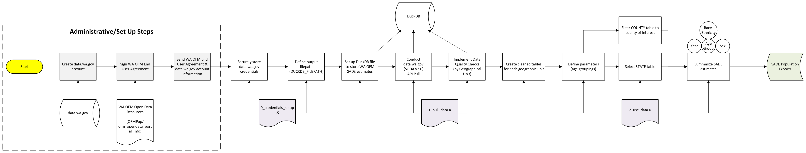

# Overview
This project facilitates pulling WA Office of Financial Management (WA OFM) Small Area Demographic (Population) Estimates (SADE) from [data.wa.gov](https://data.wa.gov/), Washington State's Open Data Portal. WA OFM SADE population estimates pulled through this project can be used to support Alone-or-in-Combination (AOIC) Race & Ethnicity categories in population health analyses.

## Motivation
WA OFM provides [publicly available](https://ofm.wa.gov/data-research/population-demographics/estimates/small-area/) and [internal](https://data.wa.gov/en/demographics/Small-Area-Demographic-Estimates-2020-present/3s8k-fvmm/about_data) SADE population estimates. This project aims to support LHJs in sustainably pulling and preparing the internal, detailed SADE population estimates for population health analyses. The internal SADE estimates represent a very large data set (9+ million rows of data) and contain granular AOIC Race-Ethnicity population estimates from 2020-2025 at the State, County, Census Tract, and Census Block geographies. 

## Author(s) & Contributor(s)
- [Tyler Bonnell](mailto:Tyler.Bonnell@co.snohomish.wa.us) (Snohomish County Health Department - Informatics & Data Management Epidemiologist)
- [Jacob Armitage](mailto:jacob.armitage@co.thurston.wa.us) (Thurston County Public Health & Social Services Deparmtent - Assessment & Evaluation Epidemiologist)
- [Neil Panlasigui](mailto:neilp@co.skagit.wa.us) (Skagit County Public Health - Epidemiologist)

## Technology Used
- R
- [Socrata SODA v2.0 API](https://dev.socrata.com/docs/endpoints.html) (used by data.wa.gov)
- [DuckDB](https://borkar.substack.com/p/r-workflows-with-duckdb)

# Data Processing Workflow

## How to Run the Code
1. Request access to the internal WA OFM SADE population estimates by reaching out to the [WA OFM Forecasting team](ofmforecasting@ofm.wa.gov) (this process will require signing an End User Agreement detailing responsible use policies). For more information, click [here](https://github.com/OFMPop/ofm_opendata_portal_info/?tab=readme-ov-file).
2. Set up a [data.wa.gov](https://data.wa.gov/) account and navigate to the [internal WA OFM SADE Population Estimates](https://data.wa.gov/en/demographics/Small-Area-Demographic-Estimates-2020-present/3s8k-fvmm/about_data) page.
3. Generate a WA OFM SADE Population Estimate - Application Token in data.wa.gov by following these [instructions](https://github.com/OFMPop/ofm_opendata_portal_info/blob/main/guides/data_interaction.md) (see the "Accessing the data and queries with the API" chapter).
4. Provide data.wa.gov API credentials and local filepath to store pulled WA OFM data by following `Scripts/0_credentials_setup.R`.
5. Run `Scripts/1_pull_data.R` to pull all of WA OFM's internal SADE population estimates and save it locally (to the `DUCKDB_FILEPATH` provided in `.Renviron`). **Note: This script takes approximately 80 minutes to complete the API pull (it's a lot of data)**
6. Open `Scripts/2_use_data.R` to see an example of how pulled data can be used to prepare AOIC Race-Ethnicity population estimates. Adapt for your own population health analyses.

### Workflow Diagram

## Use Cases
LHJs can use this project's code to:

- (`1_pull_data.R`) Pull, prepare, and save WA OFM internal SADE estimates every year when a new data vintage is released.
- (`2_use_data.R`) Extract and use pulled WA OFM internal SADE population estimates for population health analyses. This is an example script meant to highlight how AOIC population estimates can be prepared, and should be adapted to meet the needs of the specific LHJ and population health analysis being conducted!
